# 1D-Chains-and-Molecules-DFT
DFT study of molecules and one-dimensional atomic chains using VASP.

# 1D Chains and Molecules DFT Study

DFT-based structural analysis of molecular systems and one-dimensional atomic chains using VASP.

This repository documents selected results from a computational materials science project, including geometry optimization, convergence testing, cohesive-energy calculations, and electronic-structure analysis.

## Molecules

### H₂O

#### Optimized Geometry

The H₂O molecule was structurally optimized using VASP.

Calculated structural parameters:

| Property | Calculated |
|---|---:|
| O-H bond length | 0.9720 Å |
| H-O-H bond angle | 104.5341° |

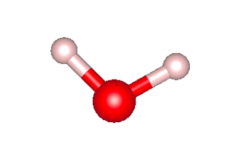

#### Linear Configuration

A linear H₂O configuration was also investigated for comparison.

| Property | Calculated |
|---|---:|
| O-H bond length | 0.9425 Å |
| H-O-H bond angle | 180.00° |

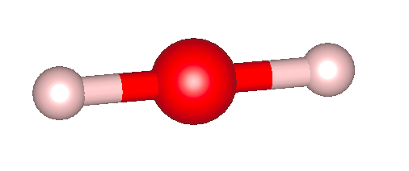

#### ENCUT Convergence

The effect of plane-wave cutoff energy on the calculated total energy was examined to determine an appropriate computational parameter.

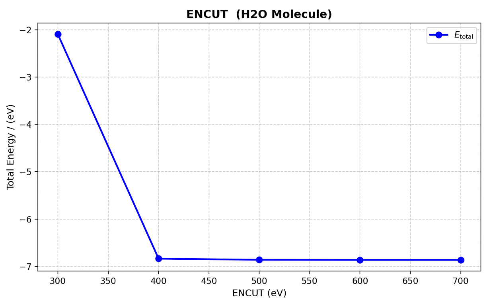

### CO₂

#### Optimized Geometry

The CO₂ molecule was structurally analyzed using VASP.

Calculated structural parameters:

| Property | Calculated |
|---|---:|
| C-O bond length | 1.176 Å |
| O-C-O bond angle | 180.0° |

#### ENCUT Convergence

The dependence of the total energy on the plane-wave cutoff energy was examined.

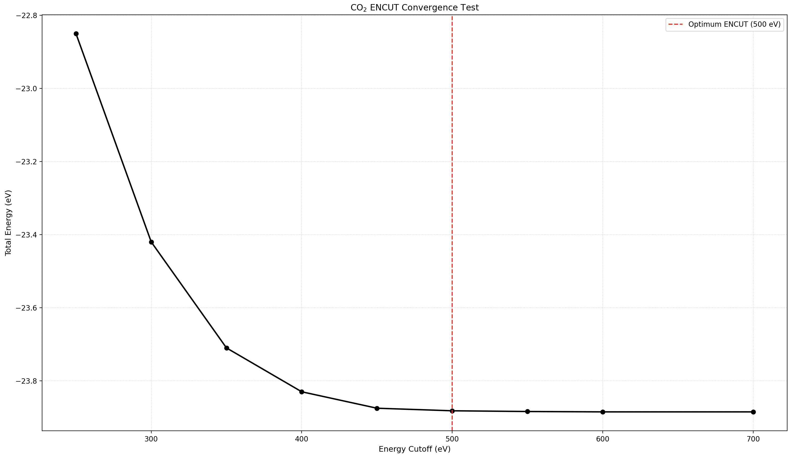

#### Vacuum Convergence

The effect of the simulation-cell vacuum size on the calculated total energy was also investigated.

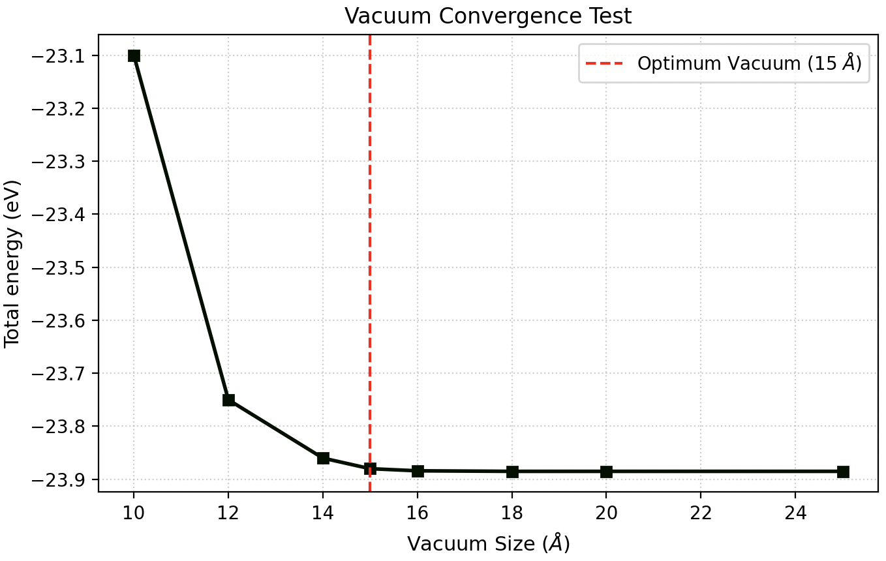

#### Cohesive Energy

The preserved project results give a calculated cohesive energy of:

**E_coh = -18.538 eV**

### O₃

#### Molecular Geometry

The molecular geometry of ozone (O₃) was investigated using VASP and visualized using VESTA.

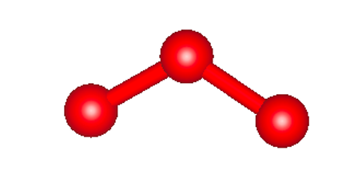

The optimized structure was compared with reference molecular-geometry values.

Reference values used for comparison:

- O-O bond length: approximately 1.278 Å
- O-O-O bond angle: approximately 116.80°

## 1D Carbon Chain

### Overview

A one-dimensional linear carbon chain was investigated using Density Functional Theory (DFT) calculations with VASP. Convergence tests were performed to determine suitable computational parameters before structural analysis.

### ENCUT Convergence

The plane-wave cutoff energy was tested to ensure convergence of the calculated total energy.

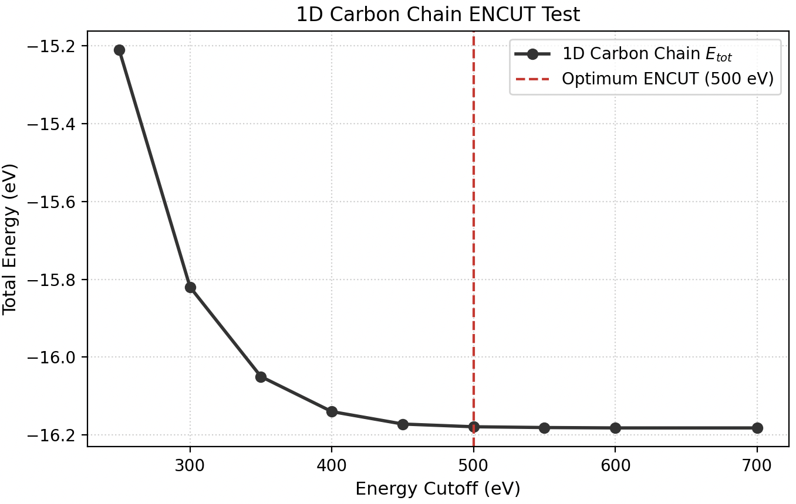

The total energy approaches a stable value as the cutoff energy is increased. Based on the convergence behavior, the selected cutoff energy was:

**ENCUT = 500 eV**

### K-Point Convergence

Since the system is periodic along the chain direction, k-point convergence was tested using meshes of the form **1 × 1 × kz**.

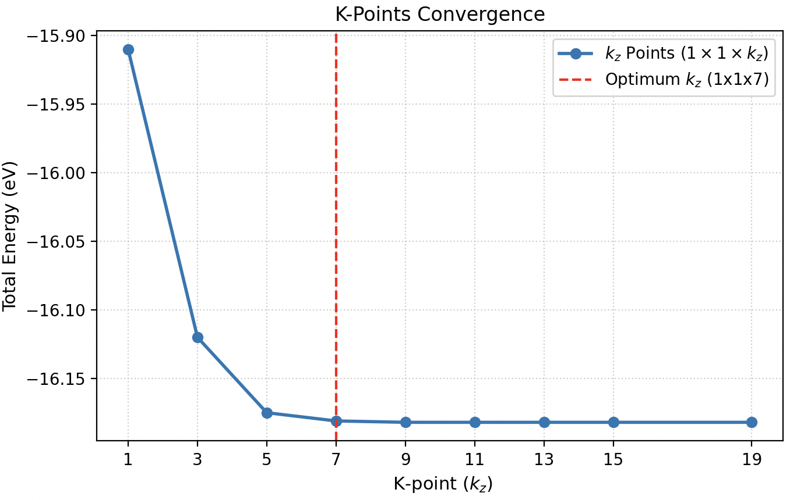

The selected k-point mesh was:

**1 × 1 × 7**

### Vacuum Convergence

A vacuum convergence test was performed to reduce interactions between periodic images of the one-dimensional carbon chain.

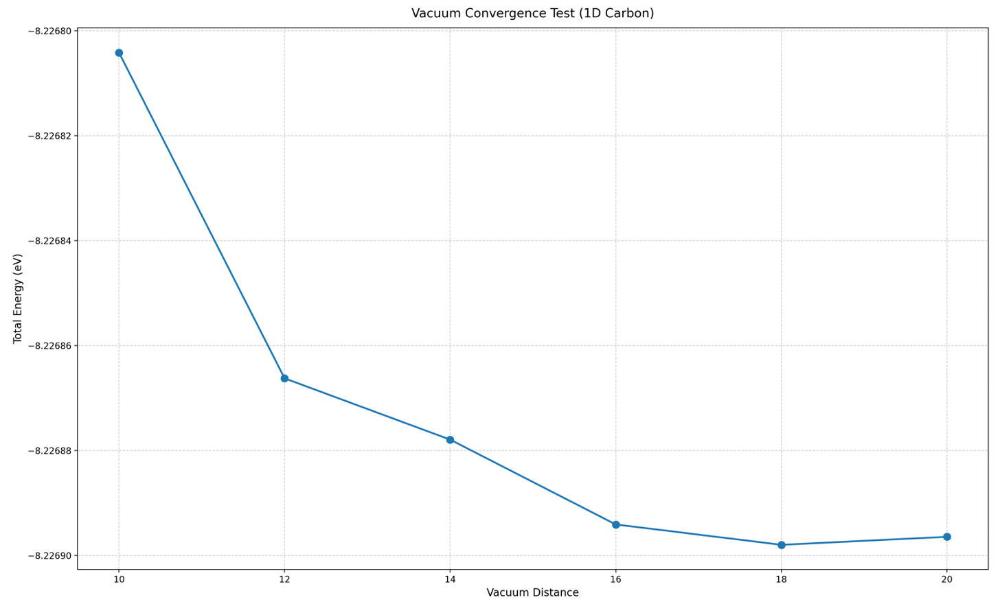

### Lattice Constant Optimization

The equilibrium lattice constant was determined by calculating the total energy for different lattice parameters.

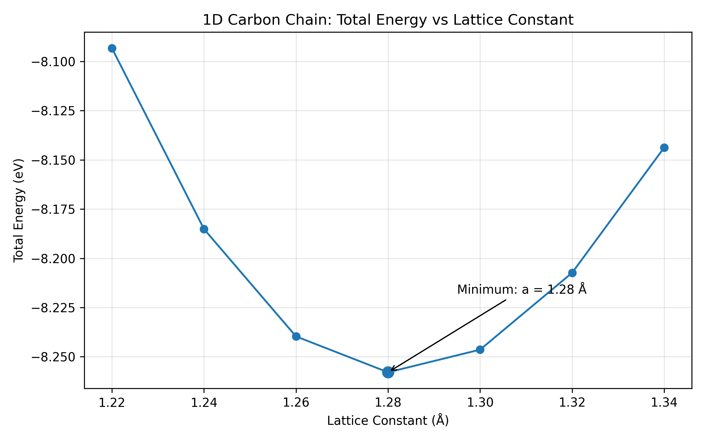

The minimum total energy was obtained at:

**a = 1.28 Å**

with:

**E = -8.25788870 eV**

### Optimized Geometry

The optimized linear carbon-chain structure was analyzed using VESTA.

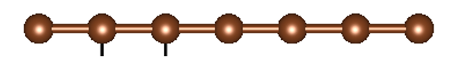

### Calculated Properties

| Property                     | Calculated Value |
| ---------------------------- | ---------------: |
| Equilibrium lattice constant |           1.28 Å |
| C-C bond length              |         1.2830 Å |
| Minimum total energy         |   -8.25788870 eV |
| Cohesive energy              | 7.001464 eV/atom |

The calculated C-C bond length is consistent with the approximately 1.28 Å value reported for linear carbon chains.

### Reference

Durgun, E., Dag, S., Bagci, V. M. K., Gulseren, O., Yildirim, T., & Ciraci, S.
*Spintronic properties of carbon-based one-dimensional atomic chains.*
Physical Review B, 74, 235413 (2006).

## Data Availability

The original calculations were performed using VASP on an HPC system during a research internship.

The original raw VASP input and output files are currently unavailable. This repository therefore contains preserved numerical results, figures, and reconstructed data tables derived from the original project records.

## Tools

- VASP
- VESTA
- Python

